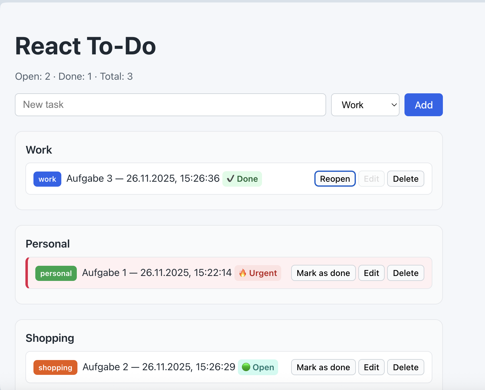

# React + TypeScript + Vite

# React To-Do Application

A React + TypeScript To-Do application built as a practical exercise in state management, UI/UX and clean component architecture.  
The project implements both **Teil 1** (core features) and **Teil 2** (categories and grouped lists) of a typical "React Coding Assignment".
It also persists data in **localStorage**, so todos survive page reloads.

---

## 🚀 Features (Teil 1)

### ✔ Core Functionality
- Add new tasks
- Edit tasks (only when status is "open")
- Mark tasks as done or reopen them
- Delete tasks
- Automatic "urgent" status:  
  A task becomes urgent if it stays open longer than 1 minute
- Task summary: open, done, total
- Display creation date and time for each task
- Data is persisted in `localStorage` so tasks remain after page reload

## 🗂️ Features (Teil 2)

### ✔ Categories
- Each task belongs to one of three categories:
  - **Work**
  - **Personal**
  - **Shopping**
- Category is selected when creating a new task.

### ✔ Grouped Lists
- Tasks are grouped by category in the UI.
- Each category has its own block with its tasks only.
- Empty categories show a short “no tasks” hint.

### ✔ State Management
- `useState` for managing todos and UI interactions  
- `useEffect` for time-based urgent detection  
- Clean separation of components and strict TypeScript types

### ✔ UI/UX
- Clean and minimal interface  
- Color-coded status badges (Open / Done / Urgent)  
- Fully keyboard-accessible form (Enter to submit)  
- Responsive layout and readable typography  
- Clear button labels and functional structure

### ✔ Accessibility
- ARIA labels  
- Keyboard-friendly interactions  
- Announcements via `aria-live` in the todo list

### ✔ Code Quality
- TypeScript interfaces for all data structures  
- Functional components  
- Small, testable components  
- Avoids unnecessary re-renders  
- Readable and commented code

---

## 📁 Folder Structure

src/
  components/
    TodoItem.tsx
    TodoList.tsx
  types/
    todo.ts
  App.tsx
  App.css
  main.tsx
  index.css

---

## 🛠 Tech Stack

- **React 18**
- **TypeScript**
- **Vite**
- **CSS (custom styles)**
- Optional: GitHub Copilot / ChatGPT for assistance

---

## 🧪 How to Run

npm install
npm run dev

App will be available at:

http://localhost:5173

## 📄 Reflection

See REFLECTION.md for a short write-up on AI usage during development.

## 📝 Part 2 (Categories & Grouped Lists)

Teil 2 of the assignment is implemented:

- Task categories: **Work**, **Personal**, **Shopping**
- Category selection when creating a task
- Todos are grouped by category in separate blocks in the UI

